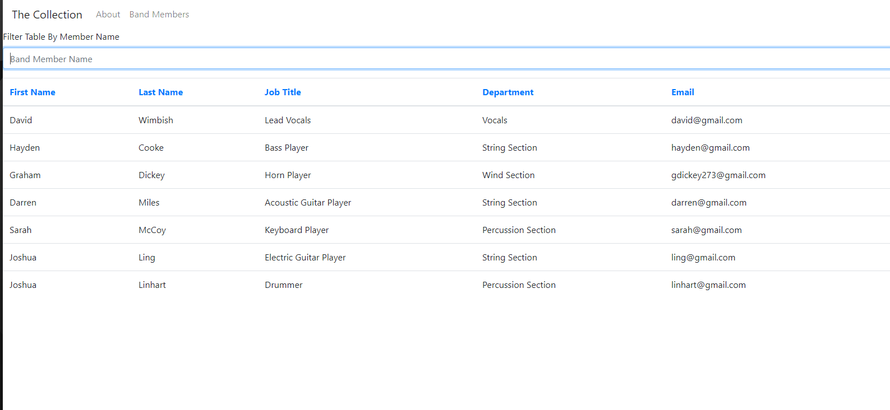
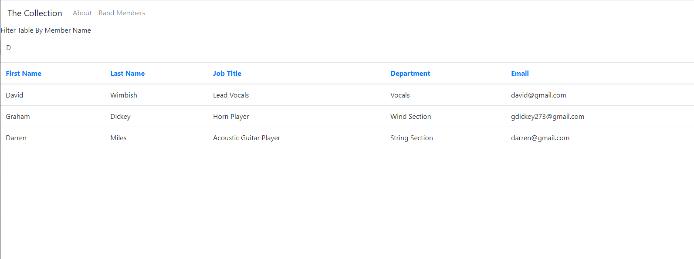

# README Generator
  
  

  ## Description 
  A react application through which the user may view table data for employees of The Collection Band, sort the data by column, and filter by member name. 

  ## Table of Contents
  * [Usage](#usage)
  * [Credits](#credits)
  * [License](#license)
  * [Contributing](#contributing)
  * [Tests](#tests)
  * [Questions](#questions)
  * [Link To Deployed Application](#link)

  

  ## Usage
  
  Upon navigating to the application the user will be directed to the About page (where they can follow links to hear our newest release). They can then use the navbar to navigate to the Band Members page where they can view a table of basic member data. The user can click on any of the table column headers to sort by that field. The user can also use the input text box above the table to filter data by member name (first or last);

  ### Usage Screenshots  
  Band Members Data Table 
  

  Filtered Band Members Data Table 
  
  
  ## Credits 
  * Graham Dickey gdickey273
 

  ## License 
  MIT License 
  Copyright (c) [2020] [Graham Dickey]
    
    Permission is hereby granted, free of charge, to any person obtaining a copy
    of this software and associated documentation files (the "Software"), to deal
    in the Software without restriction, including without limitation the rights
    to use, copy, modify, merge, publish, distribute, sublicense, and/or sell
    copies of the Software, and to permit persons to whom the Software is
    furnished to do so, subject to the following conditions:
    
    The above copyright notice and this permission notice shall be included in all
    copies or substantial portions of the Software.
    
    THE SOFTWARE IS PROVIDED "AS IS", WITHOUT WARRANTY OF ANY KIND, EXPRESS OR
    IMPLIED, INCLUDING BUT NOT LIMITED TO THE WARRANTIES OF MERCHANTABILITY,
    FITNESS FOR A PARTICULAR PURPOSE AND NONINFRINGEMENT. IN NO EVENT SHALL THE
    AUTHORS OR COPYRIGHT HOLDERS BE LIABLE FOR ANY CLAIM, DAMAGES OR OTHER
    LIABILITY, WHETHER IN AN ACTION OF CONTRACT, TORT OR OTHERWISE, ARISING FROM,
    OUT OF OR IN CONNECTION WITH THE SOFTWARE OR THE USE OR OTHER DEALINGS IN THE
    SOFTWARE.

  ## Questions
  Contact me with any questions you have regarding my project.   
  Email: gdickey273@gmail.com  
  Github: https://github.com/gdickey273  

  ## Link
  Link to deployed application: https://gdickey273.github.io/employee-directory